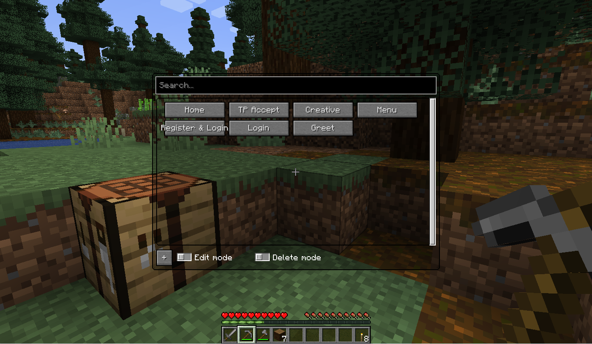
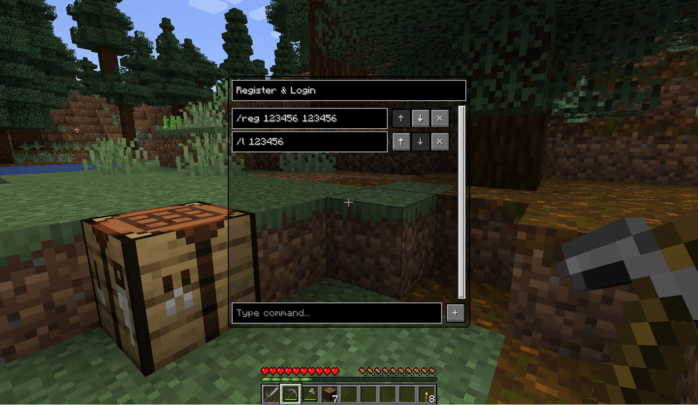

  <a title="English" href="./README.md">English</a>
  |
  简体中文

# Command GUI Buttons

> 复刻自 https://github.com/joseph-garcia/command-gui-buttons

## 描述

Command GUI Buttons 是 Minecraft 的 Fabric 模组，允许用户在其客户端上创建自定义命令按钮。
用户可以在游戏中使用 <kbd>G</kbd> 键调出此菜单，输入他们想要为其创建按钮的名称和命令。
完成之后，相关内容将在屏幕上显示为数个按钮，以便随时使用。

为预设的聊天消息、`/warp home` 等命令，或聊天框中的任何内容创建按钮。

## 依赖

| 依赖         | 类型 | 链接                                                                                                                                                             |
|------------|----|----------------------------------------------------------------------------------------------------------------------------------------------------------------|
| Fabric API | 必须 | [CurseForge](https://www.curseforge.com/minecraft/mc-mods/fabric-api) \| [Modrinth](https://modrinth.com/mod/fabric-api/)                                      | 
| LibGui     | 必须 | [GitHub](https://github.com/CottonMC/LibGui/releases) \| [Maven(Not recommend)](https://server.bbkr.space/artifactory/libs-release/io/github/cottonmc/LibGui/) |

为了方便，下方已列出下载链接：

| Minecraft 版本 | Fabric API                                                                                                                                                      | LibGui (**请使用给定的版本**)                                                          |
|--------------|-----------------------------------------------------------------------------------------------------------------------------------------------------------------|--------------------------------------------------------------------------------|
| 1.16.5       | [CurseForge](https://www.curseforge.com/minecraft/mc-mods/fabric-api/files?version=1.16.5) \| [Modrinth](https://modrinth.com/mod/fabric-api/versions?g=1.16.5) | 3.4.0 [GitHub](https://github.com/CottonMC/LibGui/releases/tag/3.4.0)          |
| 1.17.1       | [CurseForge](https://www.curseforge.com/minecraft/mc-mods/fabric-api/files?version=1.17.1) \| [Modrinth](https://modrinth.com/mod/fabric-api/versions?g=1.17.1) | 4.2.3 [GitHub](https://github.com/CottonMC/LibGui/releases/tag/4.2.3)          |
| 1.18.2       | [CurseForge](https://www.curseforge.com/minecraft/mc-mods/fabric-api/files?version=1.18.2) \| [Modrinth](https://modrinth.com/mod/fabric-api/versions?g=1.18.2) | 5.4.2 [GitHub](https://github.com/CottonMC/LibGui/releases/tag/5.4.2)          |
| 1.19.3       | [CurseForge](https://www.curseforge.com/minecraft/mc-mods/fabric-api/files?version=1.19.3) \| [Modrinth](https://modrinth.com/mod/fabric-api/versions?g=1.19.3) | 6.5.3 [GitHub](https://github.com/CottonMC/LibGui/releases/tag/6.5.3)          |
| 1.19.4       | [CurseForge](https://www.curseforge.com/minecraft/mc-mods/fabric-api/files?version=1.19.4) \| [Modrinth](https://modrinth.com/mod/fabric-api/versions?g=1.19.4) | 7.0.0-rc1 [GitHub](https://github.com/CottonMC/LibGui/releases/tag/7.0.0-rc.1) |

## 功能

- 无限制数量的按钮
- 一个按钮支持多个命令或聊天消息
- 自定义顺序执行命令或发送聊天消息
- 搜索按钮 (**区分大小写**)

## 如何使用

- 使用 <kbd>G</kbd> 键调出游戏内的菜单
- 键入要保存的按钮名称及其命令
- 按游戏内 `+` 按钮

### 工作原理

命令列表被序列化为 JSON 格式，并存储在用户的本地系统上。
当创建新按钮时，该模组会将任何新的聊天消息或命令写入 JSON，并在下一次游戏启动时加载 JSON。

## 开发

### 支持

当前主开发版本: `1.19.4`

并且使用 `预处理` 来兼容下列版本。

**注意：我们仅接受以下版本的议题。**

**请注意该信息的时效性，任何不在此列出的版本议题均会被关闭。**

- Minecraft `1.16.5`
- Minecraft `1.17.1`
- Minecraft `1.18.2`
- Minecraft `1.19.2`
- Minecraft `1.19.3`
- Minecraft `1.19.4`

### 混淆映射表

我们使用 **Mojang 官方** 混淆映射表来反混淆 Minecraft 并插入补丁程序。

### 计划

- [x] 使用 `预处理` 来支持低版本 Minecraft